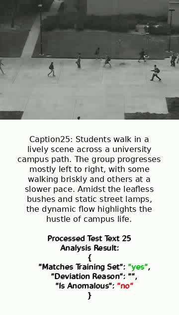

# SOR-BDNet Semantic Optical Representation for Boundary-Aware Video Anomaly Detection with GPT-4o
VAD is shifting to LLM-driven semantics. We present SOR-BDNet: annotation-free, multimodal. RGB + RAFT flow form spatiotemporal inputs; GPT-4o yields frame captions. Anomalies = semantic deviation from normal-caption memory. A Swin+contrastive boundary refiner sharpens timing. Ped2/Avenue/ShanghaiTech/Ucf-Crime: 97.96%, 82.86%, 87.36%, and 85.64%.
## 🧩 Model Overview

  

  <i>The framework takes sequential frames and corresponding optical flow maps as inputs,
and generates semantic captions through a LLM using carefully designed prompts.
A semantic repository of normal patterns is constructed from the training data.
During testing, consecutive captions are compared with the semantic repository to identify semantic deviations.
Specifically, the anomaly confidence is computed by measuring the semantic similarity between each test caption and the repository of normal captions, where a larger deviation indicates higher anomaly likelihood.
Meanwhile, raw frames are processed through a SimCLR-based feature extractor consisting of Swin Transformer and Projection Head,
where NT-Xent loss is used during training to learn discriminative normal representations.
Anomaly detection is performed through semantic deviation analysis and visual feature boundary refinement.</i>

---

## 🎯 Boundary Refinement

  

  <i>The coarse anomaly interval from GPT-4o captions is refined by a Swin-based boundary module, sharpening the start and end frames of abnormal events.</i>

---

## 📁 Directory Structure

The repository is organized into functional modules including caption generation, 
optical flow extraction, preprocessing, and the main SOR-BDNet architecture.

<pre>
SOR-BDNet/
├── caption/               # GPT-4o caption generation (semantic reasoning)
│
├── model/                 # Core SOR-BDNet components (fusion + Swin + boundary refinement)
│
├── processing/            # Preprocessing scripts & memory bank construction
│
├── prompt_gpt-4o/         # Prompt templates used for GPT-4o VQA/captioning
│
├── raft/                  # RAFT optical flow implementation
│
├── ped2.gif               # Demo GIF displayed in README
├── ped.mp4                # Subtitle + boundary refinement video demo
│
├── train_cli.py           # Main training entry point
├── raft.py                # RAFT optical flow extraction script
└── README.md              # Project documentation
</pre>

## 📥 RAFT Model Weight Download

To generate optical flow using RAFT, please download the pretrained model (.pth) and
place it inside the `raft/` folder:

https://drive.google.com/file/d/1p1CQUgYhZ1B6pR3pYrb_NpPGygERENgd/view?usp=drive_link

## 🎬 Demo (GIF)

  

---

## 📝 Summary

SOR-BDNet integrates RGB appearance, RAFT-based motion cues, and GPT-4o semantic reasoning into a unified, annotation-free multimodal framework for video anomaly detection. By leveraging these complementary signals, the model can interpret scene semantics, capture fine-grained motion dynamics, and—through its boundary-aware refinement module—more precisely estimate anomaly start and end frames, reducing temporal localization error by **35–45%** compared to caption-only approaches.

Across major benchmarks, SOR-BDNet achieves strong and consistent results: **97.96%** on UCSD-Ped2, **82.86%** on Avenue, **87.36%** on ShanghaiTech, and **85.64%** on UCF-Crime. These numbers highlight the effectiveness of combining vision + motion + semantics for robust, reliable, and interpretable anomaly detection in real-world environments.

